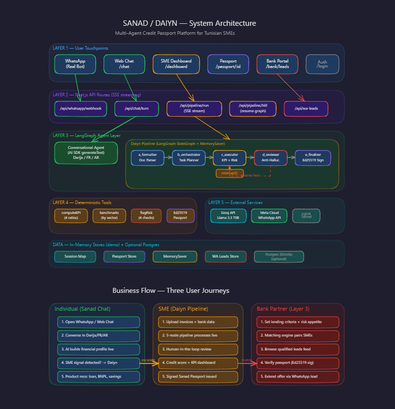

# Finnovo — Daiyn & Sanad

A multi-agent credit passport platform for SMEs in Tunisia, built for the UIK Fintech hackathon (2026-04-18).

**The product has Three layers:**
- **Sanad Chat** — a WhatsApp-native financial advisor that builds a user's credit profile through natural conversation (Darija / French / Arabic)
- **Daiyn** — a 5-node LangGraph pipeline that underwrites SME credit files and issues a signed Sanad Passport
- **Bank** - an observability dashboard for banks to monitor qualified leads for possible action taking

The demo wow: a **live agent trace panel** that shows the supervisor → specialist → critic chain producing a grounded, citeable credit score in real time and a deployed ai chatbot on whatsapp.

## Quick start

```bash
# Requires Node 20+ and pnpm 10+
pnpm install
cp .env.example .env       # fill in GROQ_API_KEY (OpenRouter key works too)
pnpm dev                   # http://localhost:3000
```

Pages: `/` landing · `/login` sign in · `/chat` Sanad Chat (WhatsApp-style) · `/dashboard` SME pipeline · `/dashboard/pipeline/demo` live run · `/bank` bank portal · `/passport/:id` credit passport · `/verify/:id` verification

## Environment variables

| Variable | Required | Description |
|---|---|---|
| `GROQ_API_KEY` | **Yes** | OpenRouter or Groq API key |
| `OPENAI_BASE_URL` | No | Defaults to `https://api.groq.com/openai/v1`. Set to `https://openrouter.ai/api/v1` for OpenRouter |
| `DATABASE_URL` | No | Postgres connection string (Neon). App boots without it |
| `WHATSAPP_LIVE` | No | Set to `1` to enable real Meta Cloud API sends |
| `WHATSAPP_TOKEN` | If live | Meta Cloud API bearer token |
| `WHATSAPP_PHONE_ID` | If live | Meta phone number ID |
| `WHATSAPP_VERIFY_TOKEN` | If live | Webhook verify token (any string you choose) |
| `WHATSAPP_APP_SECRET` | If live | App secret for HMAC signature verification |
| `SANAD_SIGNING_PRIVATE_KEY` | No | Ed25519 private key for passport signing (demo mode if unset) |
| `NGROK_AUTHTOKEN` | If live | ngrok auth token for WhatsApp tunnel |

## WhatsApp bot setup

The bot is fully wired. When you send a WhatsApp message to the business number, it replies via the AI conversational agent.

**To run locally:**

1. Start the dev server: `pnpm dev`
2. Start the ngrok tunnel: `ngrok start whatsapp --config ngrok.yml`
3. Copy the public URL (e.g. `https://xxxx.ngrok-free.app`)
4. In [Meta Developer Console](https://developers.facebook.com) → WhatsApp → Configuration → Webhook:
   - Callback URL: `https://xxxx.ngrok-free.app/api/whatsapp/webhook`
   - Verify token: value of `WHATSAPP_VERIFY_TOKEN` in your `.env`
   - Subscribe to: `messages`
5. Send a WhatsApp message to the test number → get an AI reply

> **Note:** ngrok free tier gives a new URL on every restart. Keep it running during the demo; update the Meta webhook URL if you restart.

## Architecture



**Full system diagram** shows all 5 layers:
- **Layer 1** — User Touchpoints: WhatsApp, Web Chat, Dashboard, Passport, Bank Portal, Auth
- **Layer 2** — API Routes: SSE streaming endpoints for chat, pipeline, HITL, WhatsApp webhook, leads
- **Layer 3** — LangGraph Agents: Conversational agent + 5-node Daiyn pipeline with `interrupt()` and revision loop
- **Layer 4** — Deterministic Tools: KPI math, sector benchmarks, risk flags, Ed25519 signing
- **Layer 5** — External Services: Groq API (Llama 3.3), Meta Cloud API, ngrok tunnel
- **Data Layer** — In-memory stores (session, passport, graph state, leads) + optional Postgres

Interactive version: [View on Excalidraw](https://excalidraw.com/#json=QZWK2nTO6aVOpj3AiubuX,IBapvgULukvZQlJP9T1ABQ)

## Stack

| Layer | Choice |
|---|---|
| Framework | Next.js 16 (App Router, React 19, Turbopack) |
| Language | TypeScript `strict: true` |
| Styling | Tailwind CSS v4 + shadcn/ui (New York, neutral) |
| Agents | LangGraph `@langchain/langgraph` v1.2 — supervisor pattern |
| LLMs | Llama 3.3 70B + 3.1 8B via OpenRouter (free tier) |
| DB (optional) | Postgres + Drizzle ORM |
| Charts | Recharts |
| Motion | Framer Motion |
| WhatsApp | Meta Cloud API |

## File layout

```
src/
├── app/
│   ├── page.tsx                          # landing
│   ├── chat/page.tsx                     # Sanad Chat UI
│   ├── dashboard/
│   │   ├── page.tsx                      # runs + passports overview
│   │   ├── pipeline/[runId]/page.tsx     # live pipeline view (SSE)
│   │   └── upload/page.tsx              # document upload
│   ├── login/page.tsx                    # mock auth (role picker)
│   ├── signup/page.tsx                   # mock signup flow
│   ├── bank/
│   │   ├── page.tsx                      # bank dashboard
│   │   ├── leads/page.tsx                # Layer 3: surfaced SME leads
│   │   └── criteria/page.tsx             # lending criteria config
│   ├── passport/[id]/page.tsx            # signed passport viewer
│   ├── verify/[id]/page.tsx              # passport verification
│   ├── consent/page.tsx                  # data-sharing consent
│   └── api/
│       ├── chat/turn/route.ts            # conversational agent endpoint
│       ├── pipeline/
│       │   ├── run/route.ts              # SSE pipeline stream
│       │   └── hitl/route.ts            # resume paused graph
│       └── whatsapp/webhook/route.ts    # Meta Cloud API webhook
├── components/
│   ├── agent-trace.tsx                   # live reasoning panel
│   ├── pipeline-graph.tsx                # 5-node graph visualization
│   ├── hitl-panel.tsx                    # human-in-the-loop overlay
│   ├── whatsapp-chat.tsx                 # WhatsApp-styled chat UI
│   └── ui/                              # shadcn primitives
└── lib/
    ├── ai/
    │   ├── client.ts                     # model registry (OpenRouter)
    │   └── agents/
    │       ├── conversational.ts         # Sanad Chat agent
    │       ├── pipeline.ts               # Daiyn 5-node LangGraph
    │       └── supervisor.ts            # legacy multi-agent supervisor
    ├── ai/tools/
    │   ├── kpi.ts                        # deterministic KPI math
    │   ├── benchmarks.ts                 # sector benchmark fixtures
    │   └── risk.ts                       # risk flag factory
    ├── db/schema.ts                      # Drizzle schema (3-layer)
    ├── whatsapp/client.ts                # Meta Cloud API client
    └── signing/passport.ts              # Ed25519 passport signing
```

## Scripts

- `pnpm dev` — dev server (Turbopack, :3000)
- `pnpm build` — production build
- `pnpm check` — typecheck + lint + format-check (run before commits)
- `pnpm db:generate && pnpm db:migrate` — regenerate and apply DB migrations

## Key docs

- `IDEAS.md` — hackathon concept shortlist
- `CLAUDE.md` — conventions for Claude Code
- `.claude/` — subagents, slash commands, hooks
