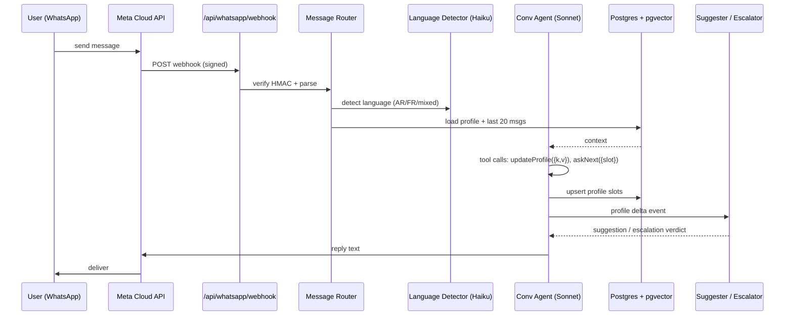

# Sanad — Software Architecture Reference

> The single source of truth for the 3-layer system. Read this before executing any prompt from PROMPTS.md. Visual companion: `docs/sanad-architecture.excalidraw` (open at https://excalidraw.com → File → Open).

## Product brief

Sanad is a financial identity platform for Tunisia. Three layers, one data graph, one brand.

| Layer | Name                | Audience                            | Primary surface          | Revenue                            |
| ----- | ------------------- | ----------------------------------- | ------------------------ | ---------------------------------- |
| 1     | **Sanad Chat**      | Individuals (banked + unbanked)     | WhatsApp bot (Darija/FR) | Lead generation                    |
| 2     | **Daiyn**           | SMEs                                | Web dashboard            | €15/Credit Passport, paid by banks |
| 3     | **Sanad for Banks** | Bank officers / microfinance / BNPL | Web dashboard            | €15 per qualified lead             |

**Tagline:** _"One passport. Every bank. Instant credit."_
**Bridge line for the pitch:** _"Open banking is the rail. Financial inclusion is the destination. Sanad is the vehicle."_

## Top-level flow (Mermaid)

```mermaid
flowchart LR
    subgraph L1["🟢 Layer 1 — Sanad Chat"]
        U[Individual\nWhatsApp user]
        META[Meta Cloud API]
        WH[Webhook]
        CONV[Conversational\nagent — Sonnet]
        PROF[Profile builder]
        SUGG[Product\nsuggester]
        ESC[SME escalation\ndetector]
        U <--> META <--> WH --> CONV --> PROF --> SUGG
        PROF --> ESC
    end

    subgraph L2["🟡 Layer 2 — Daiyn SME pipeline"]
        SME[SME owner]
        DASH[/dashboard\nupload UI]
        FMT[a) Formatter\ndocs → JSON]
        ORCH[b) Orchestrator\ngod node]
        EXEC[c) Executor\n+ tool calling]
        REV[d) Reviewer]
        FIN[e) Finalizer\ndoc + XAI]
        PP[Sanad Passport\nsigned JSON+PDF]
        SME --> DASH --> FMT --> ORCH --> EXEC --> REV
        REV -->|refine loop| EXEC
        REV --> FIN --> PP
    end

    subgraph L3["🟣 Layer 3 — Sanad for Banks"]
        BANK[Bank officer]
        BDASH[/bank dashboard]
        FEED[Profile feed]
        MATCH[Matching engine]
        ACTION[Action dispatcher]
        BANK --> BDASH --> FEED --> MATCH --> ACTION
    end

    ESC -->|promote| DASH
    U -. WhatsApp doc relay .-> DASH
    PP --> FEED
    PROF --> FEED
    ACTION -. contact back .-> META
```

## Layer 1 — Sanad Chat (WhatsApp bot)

### Goal

A conversational agent that lives inside WhatsApp, speaks Darija + French natively, incrementally builds a financial profile of the user, suggests next actions (loan, BNPL, savings, payment tools), and **escalates to Layer 2** when it detects the user is running a business.

### Technical sequence



### Conversational state model

Profile slots the agent incrementally fills:

- `identity`: first_name, age_band, city, language
- `employment`: type (salaried / gig / informal / self-employed / unemployed / student), monthly_income_band, stability_months
- `banking`: has_bank_account, bank_name?, has_mobile_wallet (D17/Flouci/Ooredoo Money/Paymee)
- `credit_history`: past_loans (count, last_12m_delinquency), current_debts
- `goals`: short_term (3-12mo: buy phone, car, rent), long_term (home, business, education)
- `sme_signal`: hires_people? sells_goods_regularly? uses_separate_wallet_for_business? → if ≥2 true, escalate

### Escalation → Layer 2 handoff

When `sme_signal` triggers:

1. Bot replies with Darija/FR explanation of the Daiyn SME upgrade.
2. User consents via a WhatsApp flow button.
3. Backend generates a signed magic-link → WhatsApp message.
4. User clicks → `/dashboard?onboard=<jwt>`, which pre-fills profile from Layer 1 data.
5. Going forward, any document image the user sends in WhatsApp is relayed into the SME dashboard inbox via the webhook.

### Models & cost

- Language detection: Haiku (~$0.001/turn)
- Conversational agent: Sonnet with extended thinking off (~$0.02/turn avg)
- Suggester/Escalator: Haiku rule pass + Sonnet sanity check on edge cases
- Embedding for memory: `voyage-2` or OpenAI `text-embedding-3-small`

### Data written to shared DB

```ts
users { id, whatsapp_id, created_at }
profiles { user_id, slots jsonb, score, sme_signal_count, escalated_at? }
conversations { id, user_id, started_at }
messages { id, conversation_id, role, text, lang, meta jsonb, created_at }
```

## Layer 2 — Daiyn (SME pipeline)

### Goal

An SME uploads a pile of messy docs (invoices, bank statements, receipts, WhatsApp screenshots). A LangGraph 5-node pipeline, with human-in-the-loop checkpoints at every node, produces a **Sanad Credit Passport** — a signed, portable credit file plus an explainability log.

### The 5 nodes

```mermaid
flowchart LR
    subgraph PIPE["LangGraph pipeline (Postgres-checkpointed)"]
        A[a) Formatter\nRead all docs\n→ unified JSON]
        B[b) Orchestrator\nGod node\nplans work]
        C[c) Executor\nBuild final doc\n+ tool calling]
        D[d) Reviewer\nCritique + send back]
        E[e) Finalizer\nPassport + XAI log]
    end
    A --> B --> C --> D
    D -->|revise| C
    D --> E
    style A fill:#fde68a
    style B fill:#fde68a
    style C fill:#fde68a
    style D fill:#fde68a
    style E fill:#fde68a

    subgraph HITL["HITL overlay — every node"]
        H1[Approve]
        H2[Refine with AI]
        H3[Take over manually]
    end
    A -.-> HITL
    B -.-> HITL
    C -.-> HITL
    D -.-> HITL
    E -.-> HITL
```

### Node contracts

**a) Formatter** — `inputs: Doc[]` → `output: FormattedCorpus`

- Classifies each doc (invoice / bank_statement / receipt / tax_form / screenshot / other)
- OCRs images with Claude Vision, parses PDFs with pdf-parse
- Produces a deduplicated, date-ordered, schema-validated JSON corpus
- Cites every line item with `source_doc_id`

**b) Orchestrator (god node)** — `inputs: FormattedCorpus + Goal` → `output: Plan[]`

- Reads the corpus, decides what type of credit file to build (operational loan / equipment financing / working capital / factoring)
- Emits a plan of tasks the Executor will run: reconstruct P&L, compute ratios, assess sector risk, write executive summary, etc.
- Chooses tool budget (how many LLM calls to spend)

**c) Executor** — `inputs: Plan + FormattedCorpus` → `output: DraftPassport`

- Uses **tool calling**:
  - `computeKPI({metric, window})` — deterministic math over the corpus
  - `queryPeerBenchmarks({sector, size})` — from seeded fixtures
  - `renderPassportSection({section, data})` — template filler
  - `flagRisk({kind, severity, evidence})` — adds to risk register
- Outputs a structured `DraftPassport` with every numeric claim tied to `source_doc_id` + `transaction_id`

**d) Reviewer** — `inputs: DraftPassport` → `output: ReviewVerdict`

- Anti-hallucination gate: every numeric claim must cite ≥1 source
- Consistency check: P&L reconciles to bank flows within tolerance
- Returns one of: `APPROVED`, `NEEDS_REVISION(reasons[])`
- If `NEEDS_REVISION`, loops back to Executor (max 1 loop, then escalates to human or finalizes with warnings)

**e) Finalizer** — `inputs: DraftPassport` → `output: SanadPassport`

- Ed25519 signs the passport body with Sanad's private key
- Renders the printable PDF (browser print-CSS)
- Writes an **explainability log**: a prose narrative of what each node did, what it found, why the score is what it is
- Persists to Postgres; returns `{passportId, verifyUrl}`

### HITL (human-in-the-loop) mechanics

Each node emits a LangGraph interrupt before completing. The dashboard subscribes to the checkpoint stream and shows three buttons per node:

- **Approve** — the node's output is accepted, pipeline continues
- **Refine with AI** — human writes feedback; the node re-runs with the feedback appended to its prompt
- **Take over manually** — the human's edits become the node's output; the run is marked `hitl=true` on that node

This is what makes the pipeline auditable. Every step is either fully-AI, AI+refined, or human-authored — and stored as such.

### Tool-calling implementation sketch

```ts
// src/lib/ai/agents/executor.ts
const tools = [
  tool({
    name: "computeKPI",
    description: "Compute a financial KPI over the formatted corpus",
    schema: z.object({ metric: z.enum(["gross_margin","current_ratio","debt_to_equity","cash_runway_days"]), window_months: z.number() }),
    func: async ({metric, window_months}) => computeKPI(corpus, metric, window_months),
  }),
  tool({ name: "queryPeerBenchmarks", ... }),
  tool({ name: "flagRisk", ... }),
  tool({ name: "renderPassportSection", ... }),
];
const executor = new ChatAnthropic({model:"claude-sonnet-4-6"}).bindTools(tools);
```

### Data written

```ts
sme_accounts { id, user_id_fk?, company_name, sector, city, created_at }
documents { id, sme_id, kind, storage_key, bytes, uploaded_at, origin_channel: "web"|"whatsapp" }
pipeline_runs { id, sme_id, status, started_at, ended_at }
run_nodes { id, run_id, node_key, input jsonb, output jsonb, hitl_mode: "ai"|"ai_refined"|"manual", operator_user_id?, ts }
passports { id, sme_id, run_id, body jsonb, signature text, issued_at, expires_at, revoked_at? }
```

## Layer 3 — Sanad for Banks

### Goal

Banks (and microfinance / BNPL / telco credit) see a **feed of qualified leads** — individuals from Layer 1 and SMEs from Layer 2 — filtered by their institution's risk appetite, ticket size, and sector focus. They take action (contact / reject / request more info) and Sanad charges per verified lead.

### Matching engine

```mermaid
flowchart TB
    P1[Layer 1 profiles\n(individuals)]
    P2[Layer 2 passports\n(SMEs)]
    BCRIT[Bank criteria\nsectors · ticket range ·\nrisk appetite · regions]
    MATCH[Matching engine\nrule-based filter +\nLLM soft-scoring]
    QUEUE[Lead queue per bank\ntiered: hot / warm / cold]
    ACTION[Dispatcher]
    BILLING[Commission event\n€15 per qualified lead]
    P1 --> MATCH
    P2 --> MATCH
    BCRIT --> MATCH
    MATCH --> QUEUE --> ACTION
    ACTION --> BILLING
```

### Action dispatcher outbound channels

- **WhatsApp (for Layer 1 individuals)** — bot sends message: "{Bank X} is interested. Reply YES to share your profile."
- **Email (for SMEs)** — formatted intro via Resend
- **In-app inbox** — banks can also leave a note visible to the SME the next time they log into `/dashboard`

### Data written

```ts
banks { id, name, criteria jsonb, api_key, webhook_url? }
leads { id, bank_id, subject_kind: "individual"|"sme", subject_id, score, status: "new"|"contacted"|"converted"|"rejected", surfaced_at }
lead_events { id, lead_id, actor_id, action, meta jsonb, ts }
billing_events { id, bank_id, lead_id, amount_eur, billed_at }
```

## Shared infrastructure

### Databases

- **Postgres (Neon free tier)** — primary OLTP. All tables in one database for simplicity during hackathon. Drizzle ORM. Migration-as-code.
- **pgvector extension** — conversational memory (Layer 1), doc chunk embeddings (Layer 2)
- **Object storage (Cloudflare R2)** — raw uploaded docs, generated PDFs, demo-video backup
- **Upstash Redis** — session state for WhatsApp conversations, job queue for background tasks

### Auth

- **Clerk** — SME users, bank officers, admin. Three roles: `sme_owner`, `bank_officer`, `admin`.
- Layer 1 individuals do NOT authenticate via Clerk — they're identified by WhatsApp phone number, mapped 1:1 to a `users` row.

### Signing

- **Ed25519** via Node's built-in `crypto.sign`. Private key in env `SANAD_SIGNING_PRIVATE_KEY`. Public key hard-coded in `/verify/[id]` for client-side verification.

### LangGraph checkpointer

- Persistent Postgres checkpointer. Every node run is checkpointed, enabling:
  - HITL pause/resume
  - Agent time-travel (rewind to a node)
  - Replay for debugging + demos

### Event bus

- **pg-boss** (Postgres-backed job queue) for background tasks: pipeline triggers, commission events, WhatsApp outbound messaging, email sends.

### External LLM / services

| Service                     | Role                       | Cost bucket                          |
| --------------------------- | -------------------------- | ------------------------------------ |
| Anthropic Claude Sonnet 4.6 | Primary reasoning          | Executor, Reviewer, Conv             |
| Anthropic Claude Haiku 4.5  | Light classification       | Language detect, Formatter, KPI tool |
| OpenAI (hot fallback)       | Failover                   | Same prompts, switch on error        |
| Groq / Gemini / OpenRouter  | BYOK fallbacks             | Free-tier hackathon insurance        |
| Meta WhatsApp Cloud API     | Layer 1 messaging          | Free tier up to 1k conv/mo           |
| Resend                      | Email (Layer 3 outbound)   | Free tier                            |
| BCT Open Banking Sandbox    | Simulated in-repo fixtures | None                                 |

## Repo layout (target after rebrand)

```
sanad/
  src/
    app/
      page.tsx                 # landing
      chat/page.tsx            # Layer 1 simulator (WhatsApp-style UI)
      dashboard/               # Layer 2 SME
        page.tsx
        upload/page.tsx
        pipeline/[runId]/page.tsx  # live pipeline + HITL UI
        passport/[id]/page.tsx
      bank/                    # Layer 3
        page.tsx
        leads/page.tsx
        leads/[id]/page.tsx
      consent/page.tsx         # OB consent mock
      memo/[packId]/page.tsx   # passport printable
      verify/[id]/page.tsx     # public passport verifier
      api/
        whatsapp/webhook/route.ts
        pipeline/run/route.ts
        pipeline/hitl/route.ts
        leads/route.ts
        upload/route.ts
    lib/
      ai/
        agents/
          conversational.ts    # Layer 1
          formatter.ts         # Layer 2 node a
          orchestrator.ts      # Layer 2 node b
          executor.ts          # Layer 2 node c + tools
          reviewer.ts          # Layer 2 node d
          finalizer.ts         # Layer 2 node e
          pipeline.ts          # LangGraph wiring
        tools/
          kpi.ts
          benchmarks.ts
          risk.ts
        canned.ts
      db/
        schema.ts              # Drizzle schema (all tables)
        queries.ts
      signing/
        passport.ts            # Ed25519 sign/verify
      matching/
        engine.ts              # Layer 3 matching
      whatsapp/
        client.ts              # Meta Cloud API client
        router.ts
    components/
      agent-trace.tsx
      pipeline-graph.tsx       # visualizes LangGraph state live
      hitl-panel.tsx           # per-node approve/refine/takeover
      passport-card.tsx
      whatsapp-chat.tsx        # UI simulator for demo
  public/
    demo/
      packs/                   # SME fixtures
      conversations/           # individual WhatsApp fixtures
      canned-trace.json
  docs/
    ARCHITECTURE.md            # ← this file
    sanad-architecture.excalidraw
  deck/
    sanad.md                   # Marp deck
    demo-video.md              # shot list
```

## What we keep from the Daiyn scaffold

- The LangGraph supervisor pattern in `src/lib/ai/agents/supervisor.ts` — we refactor it into `pipeline.ts` with the new 5-node shape. Existing state annotation + lazy model factory pattern is preserved.
- `/playground` page → repurposed as the old-style live trace viewer, kept for debugging, not a primary surface.
- `/consent` screen for OB mock — reused as the consent step inside the SME upload flow.
- `/memo/[id]` page → renamed to `/passport/[id]`, upgraded to render the signed Passport format.
- Offline canned-trace mode → kept for video recording determinism.
- Trace panel component → upgraded to the new `pipeline-graph.tsx` with HITL buttons.
- .env.example BYOK structure → extended with WhatsApp + Clerk + R2 + signing keys.

## What we throw away

- The specific 7 old agent names (OCRAgent, OBAgent, ReconcilerAgent…) — replaced by the 5-node pipeline. Tasks those old agents performed become **tools** called by the Executor.
- The "Orchestrator / Fundamentals / News / Risk / Critic / Composer" naming from the initial BVMT demo.
- Any top-level "Finnovo" references.

## Demo-day narrative (how the 3 layers show up on stage)

The 2-minute video should show all three layers so the story lands:

1. **[0:00-0:30]** — WhatsApp chat with Yassine (individual persona). Profile builds. Bot suggests a BNPL option, then detects SME signal. "You seem to sell regularly. Want to unlock Daiyn?"
2. **[0:30-1:20]** — Yassine clicks, lands on the SME dashboard pre-filled. Uploads 4 docs (mix of PDF, photo, screenshot). The LangGraph pipeline runs with HITL checkpoints visible. Human clicks "Approve" on node (b), "Refine with AI" on node (c), "Take over" on node (e) to showcase all three HITL modes.
3. **[1:20-1:50]** — Passport renders, we sign it live, scroll the `/verify` page showing the green checkmark.
4. **[1:50-2:00]** — Cut to the bank dashboard. Yassine's Passport appears in BIAT's feed as a warm lead. Bank officer clicks "Contact" — a WhatsApp message goes back to Yassine.

That loop is the pitch. Every layer shown, business model implied by the closing action.

## Engineering principles (non-negotiable)

1. **Lazy LLM instantiation** — never `new ChatAnthropic()` at module scope. Factory functions inside handlers. (Build-time envs fail otherwise.)
2. **Server/client boundary discipline** — `"use client"` only where state/effects/interactivity require it. Pass serializable props only.
3. **Schema validation at every boundary** — Zod on API input, on agent I/O, on tool args.
4. **Every passport claim has a source** — enforced by the Reviewer node. No exceptions.
5. **Idempotent writes** — pipeline runs can be retried. Use run_id + node_key as dedupe keys.
6. **Offline-first demo path** — `?offline=1` everywhere so the video shoot is deterministic.
7. **One DB, one ORM** — Postgres + Drizzle. No auxiliary databases during hackathon.
